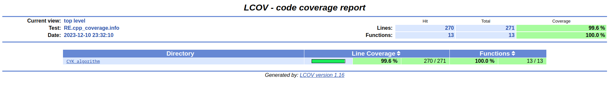

## Как запустить код

git clone https://gitlab.akhcheck.ru/timofei.kondrashov/cyk-algorithm.git

В склонированной папке:

mkdir build; cd build; cmake ..; make;

Для запуска программы ./Main

## Как запустить тесты

В склонированной папке:

cd tests; mkdir build; cd build; cmake ..; make; ctest

## Как посмотреть code coverage

В папке build из предыдущего пункта запустить следующее:

lcov --directory . --capture -o coverage.info; lcov --extract coverage.info '*/CKYAlgorithm.cpp' -o RE.cpp_coverage.info; genhtml RE.cpp_coverage.info --output-directory coverage_report

В папке build появится папка coverage_report, где в файле index.html можно найти подробную информацию.

